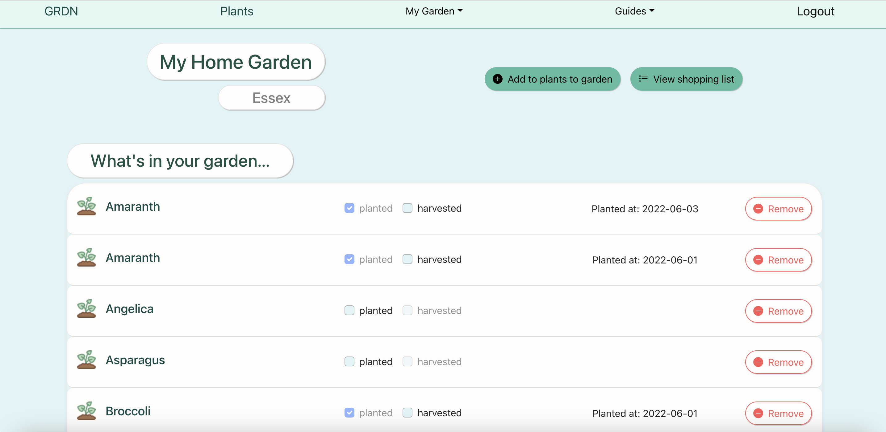
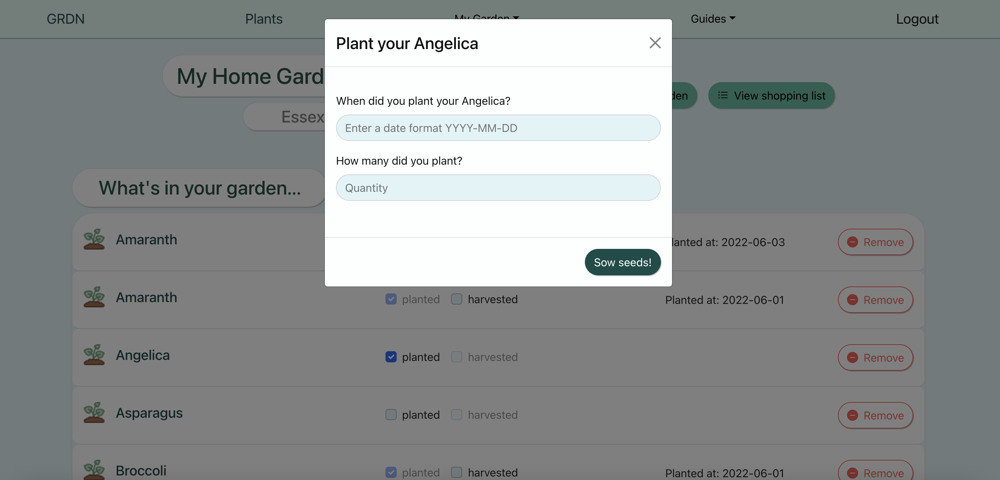

# garden-project-frontend

# URL

https://garden-project-website.sigmalabs.co.uk/sign-up

# Description

This project is a website built with React hat allows you to virtually recreate gardens and keep track of plants you have planted and harvested. The aim of this project is to bring together learning information about plants and keeping track of their garden.

# Dependencies

- react 18.1.0
- react-bootstrap 2.4.0
- react-bootstrap-icons 1.8.2
- react-router-dom 6.3.0
- react-router-hash-link 2.4.3

# How it works

You can create an account and login through the login page.

You'll then be directed to a page to create a garden

Once you create a garden, you'll be redirected to the dashboard showing the weather in the location of your garden.

The dashboard also contains reminders of when to harvest your plants, once you've planted them to your garden.

On the /plants-info page you can view different plants and the information about them. You can add them to your garden or to your shopping list to keep track of the plants you want to buy.

If you add something to your garden should be avoided planted near another plant in your garden, a pop up will show up telling you this.

You can use the search bar on the plants-info page to search plant by name as well as filter according family, sowing space and growing time.

You can also add plants to your shopping list in order to keep track of what you want to buy later.

You can view what's in your garden and record when you have planted something as well as record if it has been harvested.

